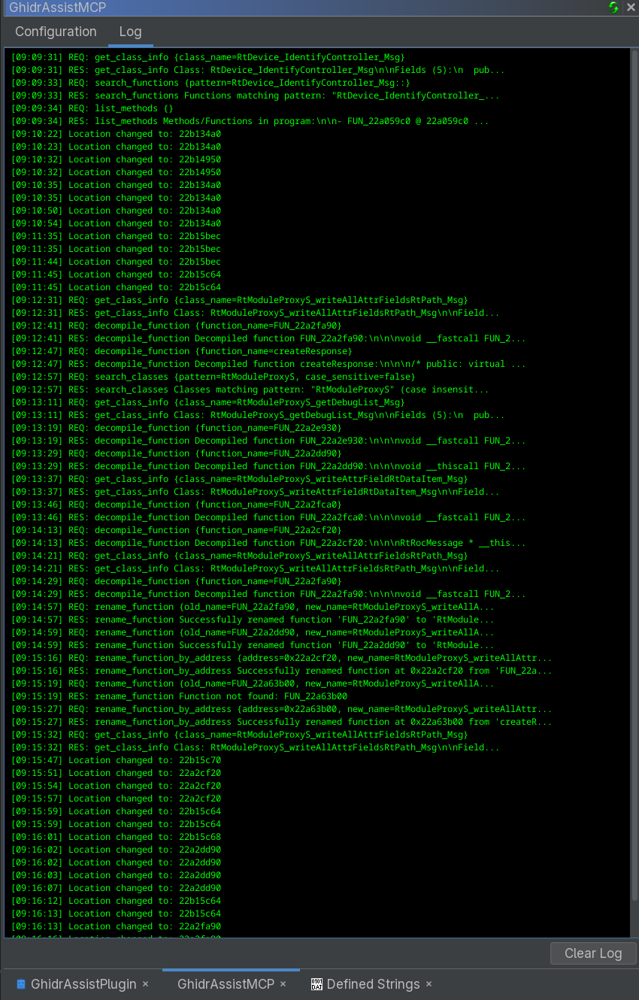

# GhidrAssistMCP

A powerful Ghidra extension that provides an MCP (Model Context Protocol) server, enabling AI assistants and other tools to interact with Ghidra's reverse engineering capabilities through a standardized API.

## Overview

GhidrAssistMCP bridges the gap between AI-powered analysis tools and Ghidra's comprehensive reverse engineering platform. By implementing the Model Context Protocol, this extension allows external AI assistants, automated analysis tools, and custom scripts to seamlessly interact with Ghidra's analysis capabilities.

### Key Features

- **MCP Server Integration**: Full Model Context Protocol server implementation using official SDK
- **Dual HTTP Transports**: Supports SSE and Streamable HTTP transports for maximum client compatibility
- **33 Built-in Tools**: Comprehensive set of analysis tools with action-based consolidation for cleaner APIs
- **5 MCP Resources**: Static data resources for program info, functions, strings, imports, and exports
- **5 MCP Prompts**: Pre-built analysis prompts for common reverse engineering tasks
- **Result Caching**: Intelligent caching system to improve performance for repeated queries
- **Async Task Support**: Long-running operations execute asynchronously with task management
- **Multi-Program Support**: Work with multiple open programs simultaneously using `program_name` parameter
- **Multi-Window Support**: Single MCP server shared across all CodeBrowser windows with intelligent focus tracking
- **Active Context Awareness**: Automatic detection of which binary window is in focus, with context hints in all tool responses
- **Configurable UI**: Easy-to-use interface for managing tools and monitoring activity
- **Real-time Logging**: Track all MCP requests and responses with detailed logging
- **Dynamic Tool Management**: Enable/disable tools individually with persistent settings

## Clients

Shameless self-promotion: [GhidrAssist](https://github.com/jtang613/GhidrAssist) supports GhidrAssistMCP right out of the box.

## Screenshots




## Installation

### Prerequisites

- **Ghidra 11.4+** (tested with Ghidra 12.0 Public)
- **An MCP Client (Like GhidrAssist)**

### Binary Release (Recommended)

1. **Download the latest release**:
   - Go to the [Releases page](https://github.com/jtang613/GhidrAssistMCP/releases)
   - Download the latest `.zip` file (e.g., `GhidrAssistMCP-v1.0.0.zip`)

2. **Install the extension**:
   - In Ghidra: **File → Install Extensions → Add Extension**
   - Select the downloaded ZIP file
   - Restart Ghidra when prompted

3. **Enable the plugin**:
   - **File → Configure → Configure Plugins**
   - Search for "GhidrAssistMCP"
   - Check the box to enable the plugin

### Building from Source

1. **Clone the repository**:

   ```bash
   git clone <repository-url>
   cd GhidrAssistMCP
   ```

2. **Point Gradle at your Ghidra install**:
   - Set `GHIDRA_INSTALL_DIR` (environment variable), or pass `-PGHIDRA_INSTALL_DIR=<path>` when you run Gradle.

3. **Build + install**:

   Ensure Ghidra isn't running and run:

   ```bash
   gradle installExtension
   ```

   This copies the built ZIP into your Ghidra install (`[GHIDRA_INSTALL_DIR]/Extensions/Ghidra`) and extracts it into your Ghidra **user** Extensions folder (replacing any existing extracted copy).

   If you need to override that location, pass `-PGHIDRA_USER_EXTENSIONS_DIR=<path>`.

4. **Restart / verify**:
   - Restart Ghidra.
   - If the plugin doesn't appear, enable it via **File → Configure → Configure Plugins** (search for "GhidrAssistMCP").

## Configuration

### Initial Setup

1. **Open the Control Panel**:
   - Window → GhidrAssistMCP (or use the toolbar icon)

2. **Configure Server Settings**:
   - **Host**: Default is `localhost`
   - **Port**: Default is `8080`
   - **Enable/Disable**: Toggle the MCP server on/off

### Tool Management

The Configuration tab allows you to:

- **View all available tools** (32 total)
- **Enable/disable individual tools** using checkboxes
- **Save configuration** to persist across sessions
- **Monitor tool status** in real-time

## Available Tools

GhidrAssistMCP provides 32 tools organized into categories. Several tools use an action-based API pattern where a single tool provides multiple related operations.

### Program & Data Listing

| Tool | Description |
| ---- | ----------- |
| `get_program_info` | Get basic program information (name, architecture, compiler, etc.) |
| `list_programs` | List all open programs across all CodeBrowser windows |
| `list_functions` | List functions with optional pattern filtering and pagination |
| `list_data` | List data definitions in the program |
| `list_data_types` | List all available data types |
| `list_strings` | List string references with optional filtering |
| `list_imports` | List imported functions/symbols |
| `list_exports` | List exported functions/symbols |
| `list_segments` | List memory segments |
| `list_namespaces` | List namespaces in the program |
| `list_relocations` | List relocation entries |

### Function & Code Analysis

| Tool | Description |
| ---- | ----------- |
| `get_function_info` | Get detailed function information (signature, variables, etc.) |
| `get_current_function` | Get function at current cursor position |
| `get_current_address` | Get current cursor address |
| `get_hexdump` | Get hexdump of memory at specific address |
| `get_call_graph` | Get call graph for a function (callers and callees) |
| `get_basic_blocks` | Get basic block information for a function |

### Consolidated Action-Based Tools

These tools provide multiple operations through an `action` parameter:

#### `get_code` - Code Retrieval Tool

| Action | Description |
| ------ | ----------- |
| `decompiler` | Decompile function to C-like pseudocode |
| `disassembly` | Get assembly disassembly |
| `pcode` | Get P-code intermediate representation |

#### `class` - Class Operations Tool

| Action | Description |
| ------ | ----------- |
| `list` | List classes with optional pattern filtering and pagination |
| `get_info` | Get detailed class information (methods, fields, vtables, virtual functions) |

#### `xrefs` - Cross-Reference Tool

| Parameter | Description |
| --------- | ----------- |
| `address` | Find all references to/from a specific address |
| `function_name` | Find all cross-references for a function |

#### `struct` - Structure Operations Tool

| Action | Description |
| ------ | ----------- |
| `create` | Create a new structure from C definition or empty |
| `modify` | Modify an existing structure with new C definition |
| `auto_create` | Automatically create structure from variable usage patterns |
| `rename_field` | Rename a field within a structure |
| `field_xrefs` | Find cross-references to a specific struct field |

#### `rename_symbol` - Symbol Renaming Tool

| Action | Description |
| ------ | ----------- |
| `function` | Rename a function |
| `data` | Rename a data label |
| `variable` | Rename a local variable or parameter |

#### `set_comment` - Comment Tool

| Action | Description |
| ------ | ----------- |
| `decompiler` | Set/modify decompiler (pseudocode) comment |
| `disassembly` | Set/modify disassembly (assembly) comment |

#### `bookmarks` - Bookmark Management Tool

| Action | Description |
| ------ | ----------- |
| `list` | List all bookmarks |
| `add` | Add a new bookmark |
| `delete` | Delete a bookmark |

### Type & Prototype Tools

| Tool | Description |
| ----- | ----------- |
| `get_data_type` | Get detailed data type information and structure definitions |
| `set_data_type` | Set data type at a specific address |
| `set_function_prototype` | Set function signature/prototype |
| `set_local_variable_type` | Set data type for local variables |

### Search Tools

| Tool | Description |
| ----- | ----------- |
| `search_bytes` | Search for byte patterns in memory |

### Async Task Management

Long-running operations (decompilation, structure analysis, field xrefs) execute asynchronously:

| Tool | Description |
| ---- | ----------- |
| `get_task_status` | Check status and retrieve results of async tasks |
| `cancel_task` | Cancel a running async task |
| `list_tasks` | List all pending/running/completed tasks |

## MCP Resources

GhidrAssistMCP exposes 5 static resources that can be read by MCP clients:

| Resource URI | Description |
| ------------ | ----------- |
| `ghidra://program/info` | Basic program information |
| `ghidra://program/functions` | List of all functions |
| `ghidra://program/strings` | String references |
| `ghidra://program/imports` | Imported symbols |
| `ghidra://program/exports` | Exported symbols |

## MCP Prompts

Pre-built prompts for common analysis tasks:

| Prompt | Description |
| ------ | ----------- |
| `analyze_function` | Comprehensive function analysis prompt |
| `identify_vulnerability` | Security vulnerability identification |
| `document_function` | Generate function documentation |
| `trace_data_flow` | Data flow analysis prompt |
| `trace_network_data` | Trace network send/recv call stacks for protocol analysis and network vulnerability identification |

## Usage Examples

### Basic Program Information

```json
{
  "method": "tools/call",
  "params": {
    "name": "get_program_info"
  }
}
```

### List Functions with Pattern Filtering

```json
{
  "method": "tools/call",
  "params": {
    "name": "list_functions",
    "arguments": {
      "pattern": "init",
      "case_sensitive": false,
      "limit": 50
    }
  }
}
```

### Decompile Function (Action-Based)

```json
{
  "method": "tools/call",
  "params": {
    "name": "get_code",
    "arguments": {
      "action": "decompiler",
      "function_name": "main"
    }
  }
}
```

### Get Class Information (Action-Based)

```json
{
  "method": "tools/call",
  "params": {
    "name": "class",
    "arguments": {
      "action": "get_info",
      "class_name": "MyClass"
    }
  }
}
```

### Search Classes (Action-Based)

```json
{
  "method": "tools/call",
  "params": {
    "name": "class",
    "arguments": {
      "action": "list",
      "pattern": "Socket",
      "case_sensitive": false
    }
  }
}
```

### Auto-Create Structure (Action-Based)

```json
{
  "method": "tools/call",
  "params": {
    "name": "struct",
    "arguments": {
      "action": "auto_create",
      "function_identifier": "0x00401000",
      "variable_name": "ctx"
    }
  }
}
```

### Find Struct Field Cross-References (Action-Based)

```json
{
  "method": "tools/call",
  "params": {
    "name": "struct",
    "arguments": {
      "action": "field_xrefs",
      "structure_name": "Host",
      "field_name": "port"
    }
  }
}
```

### Rename Function (Action-Based)

```json
{
  "method": "tools/call",
  "params": {
    "name": "rename_symbol",
    "arguments": {
      "action": "function",
      "address": "0x00401000",
      "new_name": "decrypt_buffer"
    }
  }
}
```

### Multi-Program Support

When working with multiple open programs, first list them:

```json
{
  "method": "tools/call",
  "params": {
    "name": "list_programs"
  }
}
```

Then specify which program to target using `program_name`:

```json
{
  "method": "tools/call",
  "params": {
    "name": "list_functions",
    "arguments": {
      "program_name": "target_binary.exe",
      "limit": 10
    }
  }
}
```

## Multi-Window Support & Active Context Awareness

GhidrAssistMCP uses a singleton architecture that enables seamless operation across multiple CodeBrowser windows:

### How It Works

1. **Single Shared Server**: One MCP server (port 8080) serves all CodeBrowser windows
2. **Focus Tracking**: Automatically detects which CodeBrowser window is currently active
3. **Context Hints**: All tool responses include context information to help AI understand which binary is in focus

### Context Information in Responses

Every tool response includes a context header:

```plaintext
[Context] Operating on: malware.exe | Active window: malware.exe

<tool response content>
```

or when targeting a different program:

```plaintext
[Context] Operating on: lib.so | Active window: main.exe | Total open programs: 3

<tool response content>
```

### Benefits for AI Assistants

- **Smart Defaults**: When no `program_name` is specified, tools automatically use the program from the active window
- **Context Awareness**: AI knows which binary the user is currently viewing
- **Prevents Confusion**: Clear indication when operating on a different binary than what's in the active window
- **Multi-tasking**: Work with multiple binaries without constantly specifying which one to target

## Architecture

### Core Components

```plaintext
GhidrAssistMCP/
├── GhidrAssistMCPManager     # Singleton coordinator for multi-window support
│   ├── Tracks all CodeBrowser windows
│   ├── Manages focus tracking
│   └── Owns shared server and backend
├── GhidrAssistMCPPlugin      # Plugin instance (one per CodeBrowser window)
│   └── Registers with singleton manager
├── GhidrAssistMCPServer      # HTTP MCP server (SSE + Streamable)
│   └── Single shared instance on port 8080
├── GhidrAssistMCPBackend     # Tool management and execution
│   ├── Tool registry with enable/disable states
│   ├── Result caching system
│   ├── Async task management
│   └── Resource and prompt registries
├── GhidrAssistMCPProvider    # UI component provider
│   └── First registered instance provides UI
├── cache/                    # Caching infrastructure
│   ├── McpCache.java
│   └── CacheEntry.java
├── tasks/                    # Async task management
│   ├── McpTaskManager.java
│   └── McpTask.java
├── resources/                # MCP Resources (5 total)
│   ├── ProgramInfoResource.java
│   ├── FunctionListResource.java
│   ├── StringsResource.java
│   ├── ImportsResource.java
│   └── ExportsResource.java
├── prompts/                  # MCP Prompts (5 total)
│   ├── AnalyzeFunctionPrompt.java
│   ├── IdentifyVulnerabilityPrompt.java
│   ├── DocumentFunctionPrompt.java
│   ├── TraceDataFlowPrompt.java
│   └── TraceNetworkDataPrompt.java
└── tools/                    # MCP Tools (32 total)
    ├── Consolidated action-based tools
    ├── Analysis tools
    ├── Modification tools
    └── Navigation tools
```

### Tool Design Patterns

**Action-Based Tools**: Related operations are consolidated into single tools with an `action` parameter:

- `get_code`: decompiler, disassembly, pcode
- `class`: list, get_info
- `struct`: create, modify, auto_create, rename_field, field_xrefs
- `rename_symbol`: function, data, variable
- `set_comment`: decompiler, disassembly
- `bookmarks`: list, add, delete

**Tool Interface Methods**:

- `isReadOnly()`: Indicates if tool modifies program state
- `isLongRunning()`: Triggers async execution with task management
- `isCacheable()`: Enables result caching for repeated queries
- `isDestructive()`: Marks potentially dangerous operations
- `isIdempotent()`: Indicates if repeated calls produce same result

### MCP Protocol Implementation

- **Transports**:
  - HTTP with Server-Sent Events (SSE)
  - Streamable HTTP
- **Endpoints**:
  - `GET /sse` - SSE connection for bidirectional communication
  - `POST /message` - Message exchange endpoint
  - `GET /mcp` - Receive Streamable HTTP events
  - `POST /mcp` - Initialize Streamable HTTP session
  - `DELETE /mcp` - Terminate Streamable HTTP session
- **Capabilities**: Tools, Resources, Prompts

## Development

### Project Structure

```plaintext
src/main/java/ghidrassistmcp/
├── GhidrAssistMCPPlugin.java      # Main plugin class
├── GhidrAssistMCPManager.java     # Singleton coordinator
├── GhidrAssistMCPProvider.java    # UI provider with tabs
├── GhidrAssistMCPServer.java      # MCP server implementation
├── GhidrAssistMCPBackend.java     # Backend tool/resource/prompt management
├── McpBackend.java                # Backend interface
├── McpTool.java                   # Tool interface
├── McpEventListener.java          # Event notification interface
├── cache/                         # Caching system
├── tasks/                         # Async task system
├── resources/                     # MCP resources
├── prompts/                       # MCP prompts
└── tools/                         # Tool implementations (33 files)
```

### Adding New Tools

1. **Implement McpTool interface**:

   ```java
   public class MyCustomTool implements McpTool {
       @Override
       public String getName() { return "my_custom_tool"; }

       @Override
       public String getDescription() { return "Description"; }

       @Override
       public boolean isReadOnly() { return true; }

       @Override
       public boolean isLongRunning() { return false; }

       @Override
       public boolean isCacheable() { return true; }

       @Override
       public McpSchema.JsonSchema getInputSchema() { /* ... */ }

       @Override
       public McpSchema.CallToolResult execute(Map<String, Object> arguments, Program program) {
           // Implementation
       }
   }
   ```

2. **Register in backend**:

   ```java
   // In GhidrAssistMCPBackend constructor
   registerTool(new MyCustomTool());
   ```

### Build Commands

```bash
# Clean build
gradle clean

# Build extension zip (written to dist/)
gradle buildExtension

# Install (extract) extension into the Ghidra user Extensions directory
gradle installExtension

# Uninstall (delete extracted directory from the Ghidra user Extensions directory)
gradle uninstallExtension

# Build/install with specific Ghidra path (required if GHIDRA_INSTALL_DIR isn't set)
gradle -PGHIDRA_INSTALL_DIR=/path/to/ghidra installExtension

# Debug build
gradle buildExtension --debug
```

### Dependencies

- **MCP SDK**: `io.modelcontextprotocol.sdk:mcp:0.17.1`
- **Jetty Server**: `11.0.20` (HTTP/SSE transport)
- **Jackson**: `2.18.3` (JSON processing)
- **Ghidra API**: Bundled with Ghidra installation

## Logging

### UI Logging

The **Log** tab provides real-time monitoring:

- **Session Events**: Server start/stop, program changes
- **Tool Requests**: `REQ: tool_name {parameters...}`
- **Tool Responses**: `RES: tool_name {response...}`
- **Error Messages**: Failed operations and diagnostics
- **Cache Hits**: When cached results are returned

### Console Logging

Detailed logging in Ghidra's console:

- Tool registration and initialization
- MCP server lifecycle events
- Async task execution and completion
- Cache statistics
- Database transaction operations
- Error stack traces and debugging information

## Troubleshooting

### Common Issues

#### Server Won't Start

- Check if port 8080 is available
- Verify Ghidra installation path
- Examine console logs for errors

#### Tools Not Appearing

- Ensure plugin is enabled
- Check Configuration tab for tool status
- Verify backend initialization in logs

#### MCP Client Connection Issues

- Confirm server is running (check GhidrAssistMCP window)
- Test connection: `curl http://localhost:8080/sse`
- Check firewall settings

#### Tool Execution Failures

- Verify program is loaded in Ghidra
- Check tool parameters are correct
- Review error messages in Log tab

#### Async Task Issues

- Use `get_task_status` to check task state
- Use `list_tasks` to see all tasks
- Use `cancel_task` if a task is stuck

### Debug Mode

Enable debug logging by adding to Ghidra startup:

```bash
-Dlog4j.logger.ghidrassistmcp=DEBUG
```

## Contributing

1. **Fork the repository**
2. **Create a feature branch**: `git checkout -b feature-name`
3. **Make your changes** with proper tests
4. **Follow code style**: Use existing patterns and conventions
5. **Submit a pull request** with detailed description

### Code Standards

- **Java 21+ features** where appropriate
- **Proper exception handling** with meaningful messages
- **Transaction safety** for all database operations
- **Thread safety** for UI operations
- **Comprehensive documentation** for public APIs
- **Action-based consolidation** for related tool operations

## License

This project is licensed under the MIT License - see the [LICENSE](LICENSE) file for details.

## Acknowledgments

- **NSA/Ghidra Team** for the excellent reverse engineering platform
- **Anthropic** for the Model Context Protocol specification

---

**Questions or Issues?**

Please open an issue on the project repository for bug reports, feature requests, or questions about usage and development.
